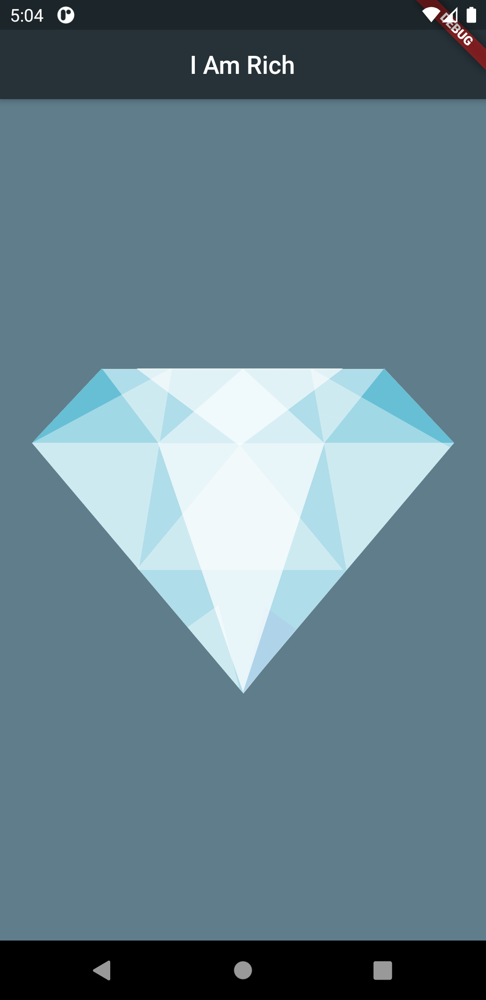

 
 <h2 align="center">I Am Rich</h2>
 
A Flutter project based on the Section 3 of <a href="https://www.udemy.com/course/flutter-bootcamp-with-dart/">Flutter Bootcamp with Dart</a>, by <a href="https://www.udemy.com/user/4b4368a3-b5c8-4529-aa65-2056ec31f37e/">Dr. Angela Yu</a>.

 

  

 

## Getting Started

A few resources to get you started in this project:

- [Lab: Write your first Flutter app](https://flutter.dev/docs/get-started/codelab)
- [Cookbook: Useful Flutter samples](https://flutter.dev/docs/cookbook)
- [Flutter Course Resources - Section 3: I Am Rich - How to Create Flutter Apps from Scratch](https://github.com/londonappbrewery/Flutter-Course-Resources#section-3-i-am-rich---how-to-create-flutter-apps-from-scratch)
